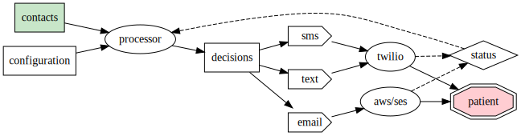

# Dr. Ann Jin Qiu patient outreach project

Dr. Ann Jin Qiu was closing down her medical practice and thus had the obligation to notify her patients and shepherd them to their new medical provider. She wanted to pay me and others $10 per hour to contact her patients manually for this, but I instead recommended she let me automate the process, thereby making it much cheaper AND more reliable. Plus, I could then share my automated solution with the world here, potentially helping other doctors as well.

## System Overview:

## Technical Details:

I used [AWS/SES](https://aws.amazon.com/ses/) for sending emails, and [Twilio](https://www.twilio.com/) for sms and voice calls. 

I started by importing her excel patient contact list into a purpose-built data structure with names, addresses, phone numbers, and email addresses.

The system is designed to be run in batches, where in each batch it makes progress against the list of people to contact. After each contact, a durable record is stored in [AWS/S3](https://aws.amazon.com/s3/). At the start of each batch run, a list of outreach decisions is made, figuring out how to contact each person, whether by email, text, or voice. That decision is based on a prioritization, and whether individual contact methods are available or not. For instance, we omit certain phone area codes, or email domains, etc.., for practical purposes. Before each contact is made, the durable record is consulted so as not to re-contact particular people. Thus, the system is robust to starting and stopping or restarting at any moment.

At the end of the project, we were able to reach the vast majority of the patients, and then provided a very small list of patients we were not able to contact back to Dr. Qiu, who took care of those herself.
